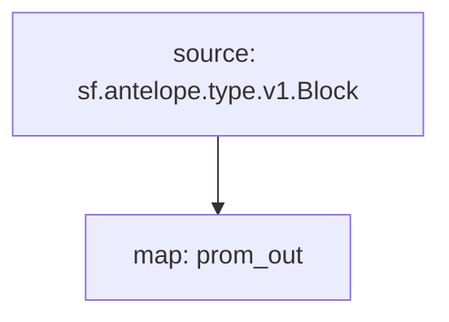

# TAISS [Substreams](https://substreams.streamingfast.io)

> [`Substreams`](https://substreams.streamingfast.io) for TAISS project

## Graph

## Related

- [TAISS Smart Contract](https://github.com/pinax-network/taiss-contract)

## References

- [Substreams](https://substreams.streamingfast.io)
- [Prometheus](https://prometheus.io)
  - [Substreams Prometheus](https://github.com/pinax-network/substreams-sink-prometheus)
  - [Substreams Prometheus Rust](https://github.com/pinax-network/substreams-sink-prometheus.rs)

## Features

- [Prometheus `GAUGE`](https://prometheus.io/docs/concepts/metric_types/#gauge)
  - [ ] temperature
